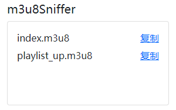
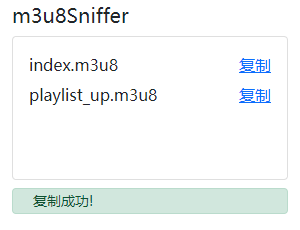
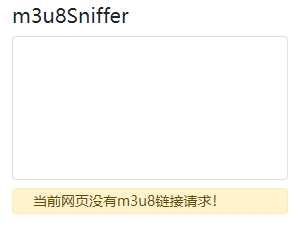

# m3u8Sniffer
## 中文  
一个可以嗅探网页发起的m3u8链接请求的Chrome扩展。  

## English  
A Chrome extension that can sniff requests for m3u8 links from web pages.  

Manifest V3版本：https://github.com/Leenshady/m3u8Sniffer2  